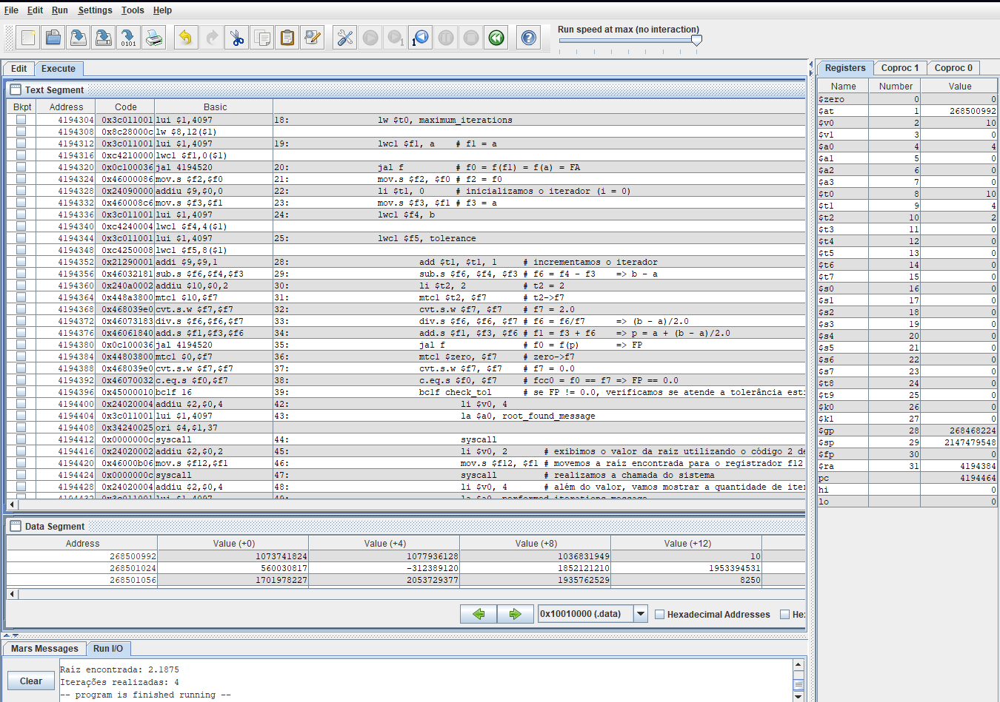

#  Método da bisseção - Assembly MIPS

Em vários problemas de ciências e engenharia um que se mostra bastante comum de ser tratado é o de se encontrar as raízes de uma equação. Este problema consiste em determinar a raiz, ou solução, de uma equação na forma `f(x) = 0`, para uma dada função `f`. Essa raiz é, normalmente, chamada de `zero da função`. Dependendo da função `f`, essa raiz pode ser encontrada por métodos analíticos. Porém, em diversas situações, é necessário aplicar métodos numéricos para tal objetivo. 

Um dos métodos numéricos mais comumente empregados para determinar raízes de equações é conhecido como `método da bisseção`. Neste procedimento, considere que tem-se uma função `f(x)` contínua e definida em um intervalo `[a, b]`, com `f(a)` e `f(b)` com sinais opostos (ou seja, `f(a) < 0` e `f(b) > 0` ou `f(a) > 0` e `f(b) < 0`). Assim sendo, pelo [teorema do valor intermediário](https://pt.khanacademy.org/math/ap-calculus-ab/ab-limits-new/ab-1-16/a/intermediate-value-theorem-review), existe um número `p` no intervalo `(a, b)` de tal forma que `f(p) = 0`, ou seja, é raiz da função `f`.

De forma resumida, o método da bisseção, que é usado para encontrar uma raiz, consiste em reduzir gradativamente o intervalo `[a, b]`, até uma determinada tolerância, e testar o valor intermediário do novo intervalo para saber se ele está próximo da raiz desejada. O algoritmo do método da bisseção está apresentado a seguir:

```
Entrada: pontos extremos a e b; tolerância TOL; número máximo de iterações N.
Saída: solução aproximada p ou mensagem de erro

Defina i = 1;
Defina FA = f(a);

Enquanto i ≤ N, faça:
  p = a + (b – a)/2;
  FP = f(p);
  Se FP = 0 ou (b – a)/2 < TOL, então:
    Exibir p
    Parar
  Fim-Se

  i = i + 1;
  Se FA * FP > 0, então:
    a = p;
    FA = FP;
  Senão:
    b = p;
  Fim-Se
Fim-Enquanto

Exibir saída: "Raiz não encontrada!"
```

Dessa forma, vamos implementar um algoritmo em Assembly para a arquitetura MIPS e simular no [MARS](http://courses.missouristate.edu/kenvollmar/mars/) para encontrar a raiz positiva da equação `f(x) = x^3 – 10` pelo método da bisseção, com `TOL = 0,1`, **máximo** de `10 iterações` e com intervalo de busca igual a `[2.0, 3.0]`.



## Referências

  - *Cálculo Numérico (com aplicações)*; 2ª edição; Leônicas Conceição Barroso e outros; Editora Harbra; 1987.
  - *Análise Numérica*; Richard L. Burden e J. Douglas Faires; Editora Thomson; 2003.
  - *Organização e Projeto de Computadores – A Interface Hardware/Software*; 3ª edição; David A. Patterson e John L. Hennessy; Editora Campus; 2005.

---

<div align="center">
  Universidade Federal do Rio Grande do Norte - UFRN <br/>
  Departamento de Engenharia de Computação e Automação - Centro de Tecnologia  <br/>
  DCA0104 – Arquitetura de Computadores - Professor: Diogo Pinheiro Fernandes Pedrosa
</div>